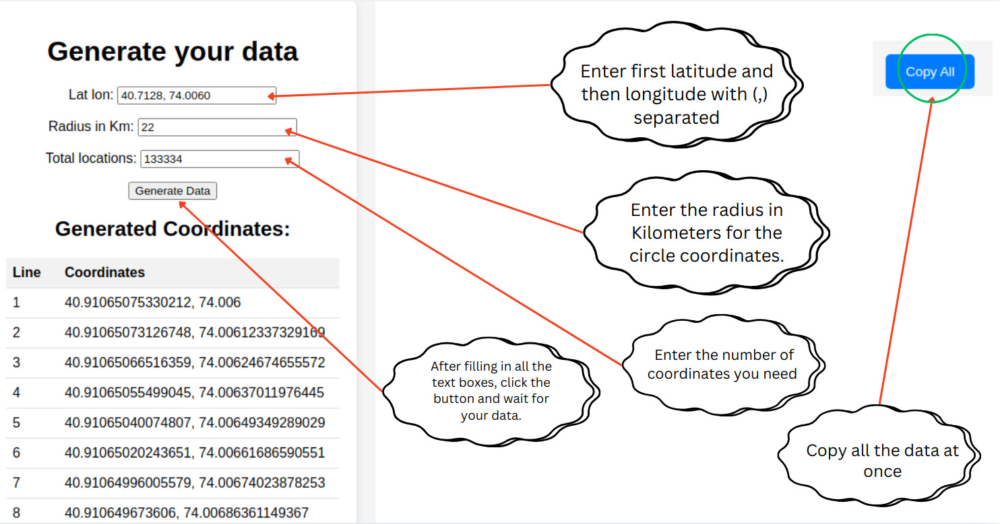
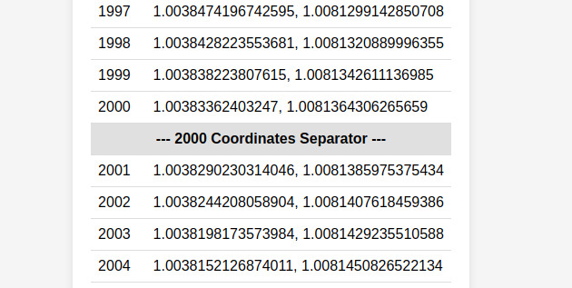
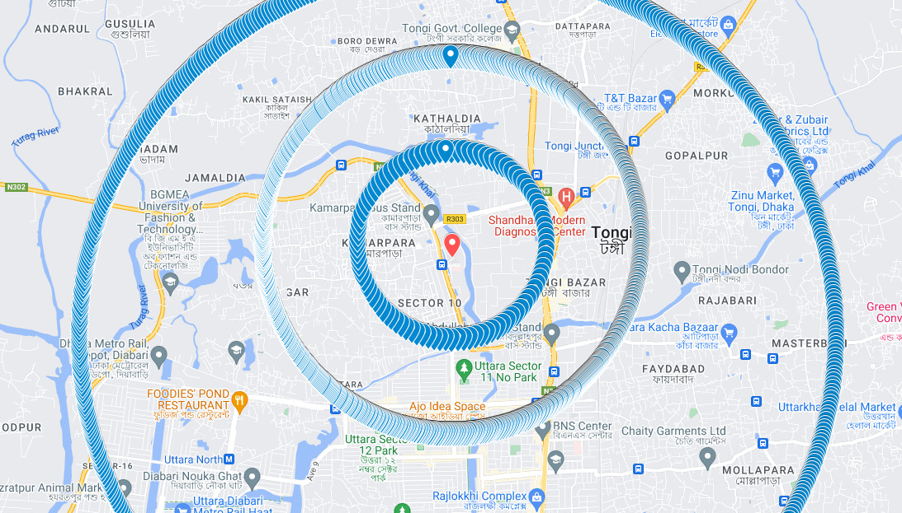
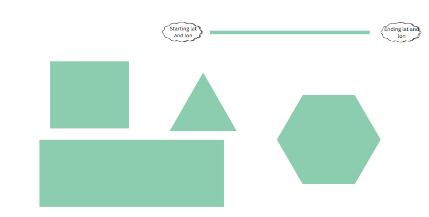

# Web Application for Generating Circular Location Coordinates


## Python & Django Application for Digital Marketers


This web application allows users to generate circular coordinates based on latitude (lat) and longitude (lon). It is designed specifically for digital marketers who require an efficient way to generate large sets of coordinates.




Currently, there are no free tools that allow users to generate an unlimited number of coordinates. Existing tools typically limit generation to fewer than 2,000 coordinates. To solve this issue, I created this project to help digital marketers generate as many coordinates as needed in one go.


# Key Feature: Auto Line Breaks
Since Google Maps does not accept more than 2,000 data points at once, this tool automatically inserts a line break after every 2,000 coordinates. This allows you to easily copy and paste the generated coordinates without exceeding the limit, or you can copy them manually if needed.



 




## Try It Live

 I have deployed the project on PythonAnywhere, and you can access it using the following link:


https://awalarifseo.pythonanywhere.com/
 
  
## Tech Stack

**Client:** Python, Django, Html, CSS, JavaScript.

**Server:** pythonanywhere.

## Run Locally

To run the project locally, follow these steps:


1. Clone the repository:

```bash
  git clone git@github.com:abdulawalarif/sabit_seo_proj.git
```

2. Navigate to the project directory:

```bash
  cd sabit_seo_proj
```

3. Activate the virtual environment:

```bash
  source .sab_seo_proj/bin/activate
```

4. Run the development server:

```bash
  python manage.py runserver
```


## Found a bug?

If you encounter an issue or would like to suggest improvements, please submit an issue using the Issues tab on GitHub. Feel free to submit a pull request (PR) with your fix, referencing the issue you created.

 ## Known issues (Work in progress)
 
* Currently, the application only generates circular data.
* Future updates will allow users to generate different shapes.



 

## Author
Created by **Abdul Awal Arif**.


- GitHub: [@abdulawalarif](https://github.com/abdulawalarif)


## License

[MIT](https://choosealicense.com/licenses/mit/)